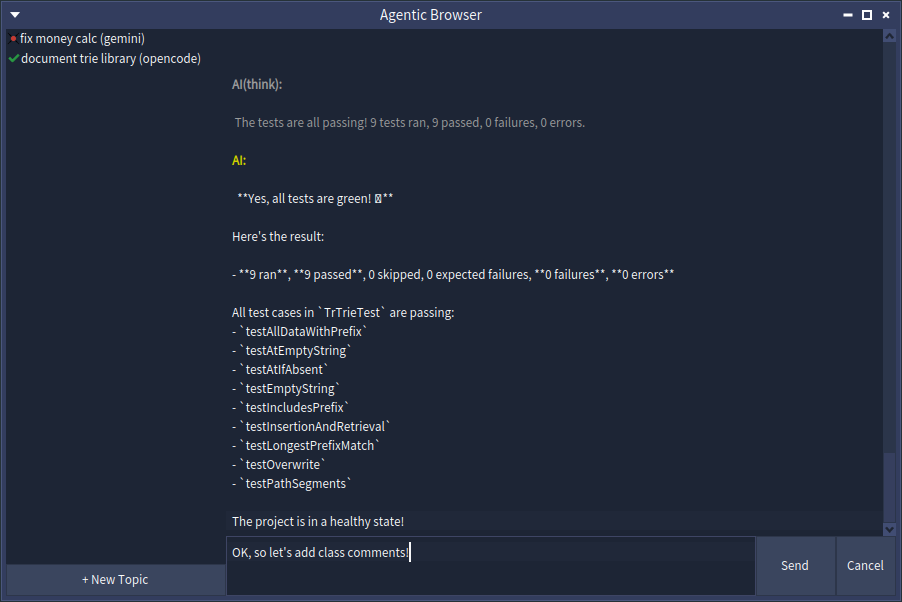

# pharo-agentic-browser

A Pharo-native UI tool for managing multiple AI coding agent sessions — Claude Code, Gemini CLI, OpenCode, and others — in parallel from inside your Pharo image. Each session is called a **topic**: you type a request, the agent works autonomously on your code, and pauses only when it needs your approval.

## Presentation

- [Introducing Pharo Agentic Browser](https://mumez.github.io/pharo-agentic-browser-slides/introducing-pharo-agentic-browser-en.html)

## Overview



```
+---------------------+-------------------------------------------+
|   Topics            |  [Human] @QueryClass refactor this        |
|                     |                                           |
|                     +-------------------------------------------+
| ❇️DB Optimization  |  [AI] I'll refactor QueryClass. First,    |
|  UI Improvement     |       let me check the current code...    |
| ✓Fix Tests         |                                           |
|                     |  [System] UserList-Core was modified;     |
|  [+ New Topic]      |           .st files have been updated     |
|                     |  [AI] May I modify DBAdapter#connect?  　 |
|                     |  [Human] yes                              |
+---------------------+-------------------------------------------+
```

The core workflow:
1. Create a topic and select an ACP-compatible agent (Gemini CLI, Claude Code, OpenCode, etc.)
2. Type a request in the chat pane — mention code context with `@ClassName` or `@ClassName>>method`
3. The AI starts working (task decomposition, code changes, tests)
4. When the AI needs human judgment, it pauses and asks in the chat
5. Respond in plain text — the AI resumes
6. Topic status is always visible in the sidebar

## Features

- **Multi-topic management** — run multiple AI agent sessions in parallel
- **Status tracking** — per-topic state machine (`initial → working → waitingForHuman → endTurn → goalAchieved`)
- **Human-in-the-loop** — conversation-style approval flow (no modal dialogs)
- **Agent-agnostic** — works with any ACP-compatible agent
- **Goal setting** — set a completion condition; the AI works autonomously until the goal is achieved, then reports back
- **Session persistence** — topic list and state are saved to `ab-topics.fuel` via Fuel and survive image restarts
- **Code mentions** — type `@ClassName` or `@ClassName>>methodName` in chat to embed the Tonel source as ACP resources
- **MCP server support** — configure MCP servers via `mcp.json`; built-in Smalltalk MCP servers can be auto-merged
- **Working directory management** — per-topic working directory for better context; custom paths for existing projects
- **Multiple package prefixes** — track multiple package families (e.g. `#('ACP-*' 'BaselineOfACP')`) per topic
- **Image change watching** — `AbTopicRelatedPackagesWatcher` monitors image changes, inserts system messages into chat, and asks for confirmation before synching packages

## Requirements

- [Pharo](https://pharo.org/) 12+
- [pharo-acp](https://github.com/mumez/pharo-acp)
- [SState](https://github.com/mumez/SState)
- [PharoSmalltalkInteropServer](https://github.com/mumez/PharoSmalltalkInteropServer)
- At least one ACP-compatible agent installed (e.g. `claude-agent-acp`, `gemini --acp`)

## Installation

In a Pharo image, open a Playground and evaluate:

```smalltalk
Metacello new
    baseline: 'AgenticBrowser';
    repository: 'github://mumez/pharo-agentic-browser:main/src';
    load.
```

To also load the test suite:

```smalltalk
Metacello new
    baseline: 'AgenticBrowser';
    repository: 'github://mumez/pharo-agentic-browser:main/src';
    load: 'Tests'.
```

## Usage

Open the browser window:

```smalltalk
AgenticBrowser open.
```

1. Click **+ New Topic**
2. Enter a title and select an agent
3. (Optional) Enter an existing project directory
4. Click **Create** — the topic appears in the left sidebar
5. Right-click the topic and choose **Set Target Packages...** to configure which packages to watch
6. Type a request and press **Send** — status changes to `❇️` (working)
7. When the AI requests permission, the Send button changes to **Confirm** and Cancel to **Deny**, and status shows `?`
8. Click **Confirm** to approve or **Deny** to reject
9. The AI resumes; when finished, status changes to `●` (endTurn)

You can also right-click a topic to **Rename...**, **Delete**, or **Set Goal...**.

> **Note:** The first message in each topic is automatically prefixed with `/st-buddy ` to activate the Smalltalk buddy agent mode.

### Code Mentions

In the chat input, you can reference Pharo classes or methods by prefixing them with `@`:

```
@QueryClass @DBAdapter>>connect please refactor this
```

When you send the message, AgenticBrowser resolves each mention to its Tonel source and attaches it as an ACP text resource alongside the prompt. The AI agent receives the exact code without any copy-paste.

You can also drag and drop directly from Pharo tools into the input field:

- Drag a **class** from the System Browser class list → inserts `@ClassName`
- Drag a **method** from the System Browser method list → inserts `@ClassName>>methodName`

### Screen Captures

Click the **`[ ]`** button in the status bar to capture a screen area and attach it to your next message.

1. Click the button — the cursor changes to a crosshair
2. Drag to select the area you want to capture
3. A mention like `@sc-20260528-001.png` is inserted into the input field
4. Send — the PNG is attached to the prompt as an image resource

The file is saved to `<agenticBrowserRoot>/screenshots/sc-YYYYMMDD-NNN.png`. You can also reference a previously captured file manually by typing `@sc-YYYYMMDD-NNN.png` in the input field.

### Goal Setting

Right-click a topic and choose **Set Goal...** to enter a completion condition (e.g., `all tests pass`). AgenticBrowser sends a goal notification prompt to the AI:

```
Goal has been set: all tests pass. When the goal is achieved, summarize and
report in result-<topic-id>.md. Keep retrying until the goal is achieved.
```

The AI works autonomously. When it creates `result-<topic-id>.md` in the working directory, AgenticBrowser reads it, stores the result, and transitions the topic to `✓` (`#goalAchieved`). From that state, the topic can only be reset to `initial` (effectively archived).

Two hooks fire when a goal is achieved:

- **Announcement** — `AbTopicGoalAchieved` is announced via the topic's own announcer, carrying the `topic` and `goal` (`AbTopicGoal`). Subscribe with:
  ```smalltalk
  topic announcer
      when: AbTopicGoalAchieved
      do: [:ann | Transcript crShow: ann topic title , ' achieved: ' , ann goal result].
  ```
- **Callback block** — register an optional block on the topic with `whenGoalAchieved:`. The block receives the `AbTopicGoal` as its argument (or takes zero arguments):
  ```smalltalk
  topic whenGoalAchieved: [:goal | Transcript crShow: goal result].
  ```

### Session Persistence

Topics are saved automatically to `ab-topics.fuel` in the AgenticBrowser root directory using Pharo's Fuel serializer. You can also save and restore manually:

```smalltalk
AbTopicManager save.
AbTopicManager load.
```

### MCP Servers

Place a `mcp.json` file in your AgenticBrowser root directory (default: `<imageDir>/agentic-browser/mcp.json`) to configure MCP servers passed to the agent on session start:

```json
{
  "mcpServers": {
    "my-server": {
      "command": "uvx",
      "args": ["my-server-package"],
      "env": {"API_KEY": "value"}
    }
  }
}
```

When `AbSettings >> useDefaultMcpServers` is `true` (the default), the built-in `smalltalk-interop` and `smalltalk-validator` MCP servers are automatically merged with your `mcp.json` entries. User entries take precedence over the defaults. Set `useDefaultMcpServers` to `false` to use only your `mcp.json`.

### Image Change Watching

Watching starts automatically when a topic first connects (on the first **Send**).

## Supported Agents

Any ACP compatible coding agent can be used. The following agents are available as presets in the New Topic dialog:

| Agent | Arguments | Install |
|-------|-----------| ----------- |
| Claude Code | [`claude-agent-acp`](https://github.com/agentclientprotocol/claude-agent-acp) | `npm install -g @agentclientprotocol/claude-agent-acp` |
| Codex | [`codex-acp`](https://github.com/zed-industries/codex-acp) | `npm install -g @agentclientprotocol/codex-acp` |
| Gemini CLI | [`gemini --acp`](https://github.com/google-gemini/gemini-cli) | ACP is built-in |
| OpenCode | [`opencode acp`](https://github.com/anomalyco/opencode) | ACP is built-in |
| GitHub Copilot CLI | [`copilot --acp --stdio`](https://docs.github.com/en/copilot/reference/copilot-cli-reference/acp-server) | ACP is built-in |
| Cursor CLI | [`agent acp`](https://cursor.com/cli) | ACP is built-in |
| Kilo Code | [`kilo acp`](https://kilo.ai/cli) | ACP is built-in |

> **Strongly Recommended:** Install the [smalltalk-dev-plugin](https://github.com/mumez/smalltalk-dev-plugin) in your agent. It provides Smalltalk-aware skills and MCP servers that agents can use to work directly with Pharo inside the session.

### Adding a Custom Agent

To add a custom agent, edit `ab-settings.json` directly in a text editor. Alternatively, from a Playground:

```smalltalk
AbSettings default codingAgents: (AbSettings default codingAgents copyWith:
    {'name' -> 'my-agent'.
    'command' -> #('my-agent' '--acp')} asDictionary).
AbSettings save.
```

## Package Structure

| Package | Contents |
|---------|----------|
| `AgenticBrowser-Core` | Domain model: `AbTopic`, `AbTopicSession`, `AbTopicManager`, `AbTopicGoal`, `AbMessage`, `AbWorkingDirectory`, `AbMcpServersLoader`, `AbCodeMentionParser`, `AbCodeMentionEmbedder`, `AbTopicRelatedPackagesWatcher`, announcements |
| `AgenticBrowser-Handler` | ACP callback bridge: `AbTopicHandler` |
| `AgenticBrowser-UI` | Spec2 presenters: browser, topic list, chat, new-topic dialog, settings dialog, and other dialogs |
| `AgenticBrowser-Tests` | SUnit tests for Core |
| `BaselineOfAgenticBrowser` | Metacello baseline |

## Architecture

### State Machine (SState)

Each topic has an FSM with five states:

```
#initial ──promptSent──▶ #working ──permissionRequested──▶ #waitingForHuman
                             ▲                                      │
                             └──────────humanResponded──────────────┘
                             │
                          turnEnded
                             ▼
                          #endTurn ──promptSent──▶ #working
                             │
                          goalReached
                             ▼
                          #goalAchieved ──reset──▶ #initial
```

### Human-in-the-Loop Approval

When the AI requests permission, `AbTopicHandler#requestPermission:` puts the UI into approval mode (Send button becomes **Confirm**, Cancel becomes **Deny**). When the user clicks a button, the UI returns to normal mode.

### Goal Setting (`AbTopicGoal`)

`AbTopicGoal` holds the goal description, result text (once achieved), and an optional callback block. It manages the result file path (`result-<topicId>.md` in the working directory). After each `end_turn`, `AbTopic>>checkGoalAchievement` checks whether the file exists; if so, the topic transitions to `#goalAchieved` and fires an `AbTopicGoalAchieved` announcement.

### Code Mentions (`AbCodeMentionParser` / `AbCodeMentionEmbedder`)

`AbCodeMentionParser` scans raw chat input for `@Foo` and `@Foo>>bar` tokens and returns `AbCodeMention` value objects. `AbCodeMentionEmbedder` resolves each mention to its Tonel source using `TonelWriter` and produces URL→content associations. `AbChatPresenter` calls both before sending and passes the resolved resources to `AbTopic>>sendPrompt:withResources:`.

### MCP Servers (`AbMcpServersLoader`)

`AbMcpServersLoader` reads `mcp.json` from `AbSettings>>defaultAgenticBrowserRootDirectory`, optionally merges built-in Smalltalk server definitions (controlled by `AbSettings>>useDefaultMcpServers`), and returns an `OrderedCollection of ACPMcpServer`. `AbTopicSession` calls it on every connect and passes the result to the ACP session params (`newSessionBy:`, `resumeSessionBy:`, `loadSessionBy:`).

### Working Directory (`AbWorkingDirectory`)

Each topic has a working directory at `<imageDir>/agentic-browser/<safe-topic-name>-<uuid8>/`. The UUID suffix ensures stability even if the topic title changes.
You can also set a custom working directory path when creating a topic from an existing project directory.

### Package Change Watcher (`AbTopicRelatedPackagesWatcher`)

`AbTopicRelatedPackagesWatcher` subscribes to `SystemAnnouncer` for `MethodAnnouncement` and `ClassAnnouncement`. When a method or class is saved:

- If the package matches any of the topic's `packagePrefixes`, it inserts a message into the chat (e.g. `"AgenticBrowser-Core was modified; .st files have been updated"`) and confirms exporting the package
- If the package does **not** match, it add the package to `updatedExternalPackageNames`. They can be moved to tracked packages by 'Apply Updated External Packages' menu 
- Changes during import are suppressed to avoid re-export loops

## Settings

Settings are managed by `AbSettings` and persisted as `ab-settings.json` in the AgenticBrowser root directory. There are two levels: global defaults and per-topic overrides.

### Global Settings

Open the Settings dialog from the **Settings…** menu in the browser window's menu bar. The dialog covers timeout values, timeout options, and MCP server preferences.

| Key | Default | Description |
|-----|---------|-------------|
| `codingAgents` | (built-in list) | Array of `{name, command}` dicts shown in the New Topic dialog |
| `useDefaultMcpServers` | `true` | Merge built-in Smalltalk MCP servers into `mcp.json` |
| `aiPermissionWaitTimeoutSeconds` | `1800` | Seconds to wait for human response to an AI permission request |
| `aiPermissionTimeoutOption` | `#reject_once` | Auto-response on timeout: `#allow_once`, `#allow_always`, or `#reject_once` |
| `exportApprovalWaitTimeoutSeconds` | `30` | Seconds to wait for human approval of a package export |
| `exportApprovalTimeoutOption` | `#reject_once` | Auto-response on export timeout |
| `watcherMessageThrottleSeconds` | `2` | Minimum seconds between watcher system messages for the same package |

### Per-Topic Settings

Each topic starts with a copy of the global settings. Right-click a topic in the sidebar and choose **Edit Settings...** to open the settings dialog for that topic alone.

Per-topic settings are persisted with the topic via Fuel when `AbTopicManager save` is called.

## Related Projects

- [pharo-acp](https://github.com/mumez/pharo-acp) — ACP client library for Pharo
- [SState](https://github.com/mumez/SState) — Simple state machine library for Pharo
- [PharoSmalltalkInteropServer](https://github.com/mumez/PharoSmalltalkInteropServer) — HTTP API server for Pharo package import/export/test
- [smalltalk-dev-plugin](https://github.com/mumez/smalltalk-dev-plugin) — AI agents plugin providing Smalltalk-aware skills and slash commands

## License

MIT
